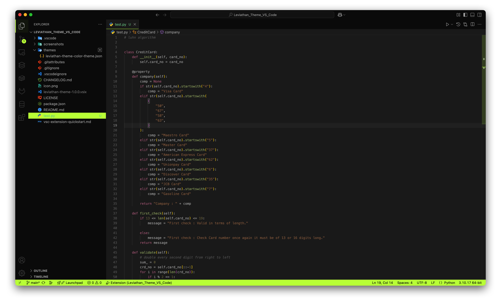

# Leviathan Theme

A sleek dark VS Code theme featuring vibrant green accents and frosted glass effects, inspired by modern gaming aesthetics.


## 🎨 Features

- **Dark Interface**: Deep black backgrounds (#0a0a0a, #212121) for reduced eye strain
- **Vibrant Green Accents**: Bright lime green (#c3ff45) for active elements and highlights
- **Frosted Glass Effect**: Semi-transparent overlays for modern visual depth
- **Optimized Syntax Highlighting**: Carefully crafted colors for enhanced code readability
- **Gaming-Inspired Design**: Razer-like aesthetic with black and green color scheme

## 🖼️ Preview



*Dark interface with vibrant green accents and optimized syntax highlighting*

## 🚀 Installation

### Via VS Code Marketplace
1. Open VS Code
2. Go to Extensions (`Ctrl+Shift+X` / `Cmd+Shift+X`)
3. Search for "Leviathan Theme"
4. Click **Install**
5. Go to `File > Preferences > Color Theme` (or `Code > Preferences > Color Theme` on macOS)
6. Select **Leviathan Theme**

### Manual Installation
1. Clone this repository or download as ZIP
2. Copy the theme folder to your VS Code extensions directory:
   - **Windows**: `%USERPROFILE%\.vscode\extensions`
   - **macOS**: `~/.vscode/extensions`
   - **Linux**: `~/.vscode/extensions`
3. Restart VS Code
4. Go to `File > Preferences > Color Theme` and select **Leviathan Theme**

## 🎯 Color Palette

| Element | Color | Usage |
|---------|-------|-------|
| Editor Background | `#212121` | Main editing area |
| Sidebar Background | `#0a0a0a` | Activity bar, file explorer |
| Accent Green | `#c3ff45` | Active selections, cursor, highlights |
| Primary Text | `#b0b0b0` | Default text color |
| Comments | `#666666` | Code comments (italic) |
| Keywords | `#b96d8a` | Language keywords (import, var, etc.) |
| Strings | `#9c6d4c` | String literals |
| Functions | `#a2b271` | Function names and calls |
| Numbers | `#7a7249` | Numeric values |

## 🛠️ Theme Highlights

- **File Explorer**: Bright green selection that stays visible even when unfocused
- **Status Bar**: Eye-catching green status bar with black text
- **Active Tab**: Green border indicator for active files
- **Cursor**: Bright green cursor for easy tracking
- **Syntax Colors**: Carefully chosen colors for optimal readability

## 📝 Optimized For

This theme works great with:
- JavaScript/TypeScript
- Python
- Swift
- HTML/CSS
- JSON
- Markdown
- React/Vue
- And many more languages!

## 🛠️ Customization

Want to tweak something? You can override specific colors in your VS Code settings:

```json
{
    "workbench.colorCustomizations": {
        "[Leviathan Theme]": {
            "editor.background": "#your-custom-color",
            "statusBar.background": "#your-accent-color"
        }
    }
}
```

## 🐛 Issues & Feedback

Found a bug or have a suggestion? Please create an issue on our [GitHub repository](https://github.com/your-username/Leviathan_Theme_VS_Code/issues).

## 📄 Version History

### v1.0.0
- Initial release
- Dark theme with green accents
- Frosted glass transparency effects
- Optimized syntax highlighting for multiple languages
- Gaming-inspired color palette

## 🤝 Contributing

Contributions are welcome! Feel free to:
- Report bugs
- Suggest new features
- Submit pull requests
- Share screenshots of the theme in action

## 📜 License

This project is licensed under the MIT License.

## 🙏 Acknowledgments

- Inspired by modern gaming aesthetics and Razer's design language
- Built for developers who love dark themes with vibrant accents
- Thanks to the VS Code community for feedback and support

---

**Ready to code with style?** Install Leviathan Theme and experience coding with a sleek, modern interface! 🐍✨

If you enjoy this theme, please consider:
- ⭐ Starring the repository
- 📝 Leaving a review on the VS Code marketplace
- 🐦 Sharing it with fellow developers
